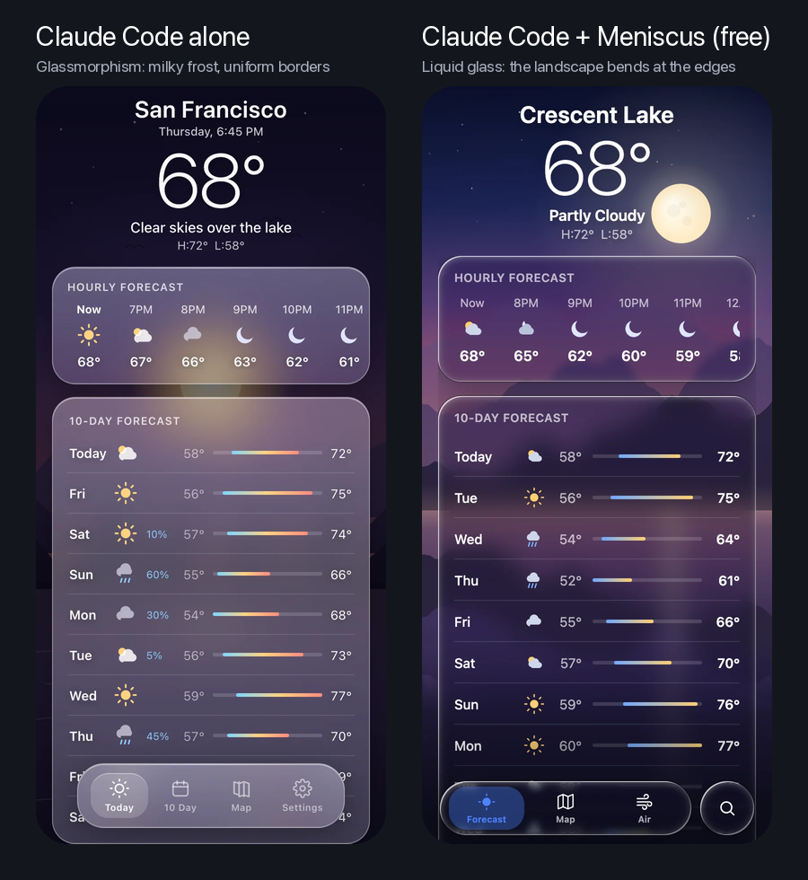

# Meniscus — liquid glass MCP server for Claude Code, Cursor and Codex

[](https://meniscus.site/#proof)

Ask a coding agent for "liquid glass" and you get glassmorphism: a blur with a white border. Meniscus is a hosted MCP
server that teaches Claude Code, Cursor, Codex and any MCP client the real thing, Apple's iOS 26/27 material, where
the backdrop bends at the edge of every control. Your agent gets a design language with tested numbers, 34 component
and 10 effect specs, build recipes with code for **CSS and web, SwiftUI, Flutter, React Native and Figma**, ten
screen templates and 100+ verified reference renders. The free plan covers every recipe.

**Website:** [meniscus.site](https://meniscus.site) · **Docs:** [meniscus.site/docs](https://meniscus.site/docs) ·
**Guide:** [What is liquid glass?](https://meniscus.site/liquid-glass) · **Specs:** [components](https://meniscus.site/components),
[effects](https://meniscus.site/effects) · **Free tool:** [CSS generator](https://meniscus.site/generator) ·
**Pricing:** [meniscus.site/pricing](https://meniscus.site/pricing)

## Install

The server is remote (Streamable HTTP) at `https://meniscus.site/mcp`. Sign-in is OAuth in the browser: there is no
API key to paste. It is listed in the official MCP Registry as `site.meniscus/meniscus` ([server.json](server.json)).

### Claude Code: plugin (server + skill)

```
/plugin marketplace add meniscus-site/meniscus-mcp
/plugin install meniscus@meniscus
```

Then run `/mcp`, choose meniscus and sign in. The plugin adds the server and the
[`liquid-glass` skill](plugins/meniscus/skills/liquid-glass/SKILL.md), so Claude reaches for the tools whenever you
ask for glass. Server only: `claude mcp add --transport http meniscus https://meniscus.site/mcp`.
More: [meniscus.site/docs/claude-code](https://meniscus.site/docs/claude-code).

### Codex: plugin (server + skill)

```bash
codex plugin marketplace add meniscus-site/meniscus-mcp
codex plugin add meniscus@meniscus
codex mcp login meniscus
```

Server only: `codex mcp add meniscus --url https://meniscus.site/mcp`. The CLI, the IDE extension and the ChatGPT
desktop app share one config. More: [meniscus.site/docs/codex](https://meniscus.site/docs/codex).

### Cursor

[](https://cursor.com/en/install-mcp?name=meniscus&config=eyJ1cmwiOiJodHRwczovL21lbmlzY3VzLnNpdGUvbWNwIn0%3D)

Or add to `~/.cursor/mcp.json` (or the project's `.cursor/mcp.json`); Cursor asks you to sign in the first time it
connects. More: [meniscus.site/docs/cursor](https://meniscus.site/docs/cursor).

```json
{
  "mcpServers": {
    "meniscus": { "url": "https://meniscus.site/mcp" }
  }
}
```

### VS Code, Claude desktop and 30 more clients

- **VS Code:** [Add to VS Code](https://vscode.dev/redirect/mcp/install?name=meniscus&config=%7B%22type%22%3A%22http%22%2C%22url%22%3A%22https%3A%2F%2Fmeniscus.site%2Fmcp%22%7D),
  or `"meniscus": { "type": "http", "url": "https://meniscus.site/mcp" }` under `servers` in `.vscode/mcp.json`.
- **Claude desktop and claude.ai:** Customize → Connectors → Add custom connector, paste the server URL, then Connect.
- **Gemini CLI, Copilot CLI, Windsurf/Devin, Zed, JetBrains, Cline, Kiro, OpenCode, ChatGPT and more:** each client's
  steps are on [meniscus.site/docs](https://meniscus.site/docs). Any client with remote servers and OAuth works: give
  it the URL and it finds the sign-in by itself.

## Same request, with and without Meniscus

The image above: one request for a weather app with "liquid glass cards and a floating liquid glass tab bar", given
word for word to Claude Code (Claude Sonnet 5) in fresh sessions. Alone it built milky frost with a uniform white
border on every card. With Meniscus on the free plan it built clear glass that bends the mountains and lake at every
edge, with the selected tab as a lens. Nothing edited; two runs per side; both pages run live at
[meniscus.site/#proof](https://meniscus.site/#proof), and [how they were made](https://meniscus.site/proof/README.md).

## Ask for a screen

Name the platform and the parts; your agent picks the tools.

```
Build a music player screen as one index.html: album art behind liquid glass playback controls and a floating glass tab bar. Use the meniscus tools.
```

```
Add a liquid glass bottom navigation bar to this Flutter app that refracts the photo behind it, not just blurs it. Use the meniscus tools.
```

```
Review the tab bar in this project against the liquid glass rules and list what reads as glassmorphism, with fixes.
```

## Tools

| Tool | What it returns |
|---|---|
| `create_design_brief` | One call for a concrete screen: direction, tokens, the specs it needs, the build code for your stack, a checklist and two reference images. |
| `get_guidelines` | The design language; with a medium (`design-tool`, `web`, `swiftui`, `flutter`, `react-native`) also that medium's limits and recipe index. |
| `get_recipe` | A medium's build recipe with its code, whole or one section at a time. |
| `get_component_spec` | One of 34 components: material, geometry, optics numbers, anatomy, states, rules, references. |
| `get_effect_spec` | One of 10 effects or accent materials: refraction, frost, specular, dispersion, iridescence, caustics, morph, tint, liquid metal, border beam. |
| `get_template` | Ten whole screens (smart home, wallet, AI chat, weather and more) as React source. |
| `search_references` | Search the reference renders by text and filters (kind, component, effect, platform, theme). |
| `get_references` | Load reference images by id, cropped to the glass or full frame. |
| `get_platform_support` | What is implemented and verified on each platform. |

All tools are read-only. Three prompts come with them: `build_screen`, `review_glass` and `add_component`.

## Liquid glass on each platform, in one line

- **CSS and web:** an SVG displacement map applied with `backdrop-filter: url(#filter)` bends the live page in
  Chromium; Safari and Firefox need a frost fallback; a WebGL shader bends a known backdrop everywhere.
  [Guide with the code](https://meniscus.site/liquid-glass/css)
- **SwiftUI (iOS 26+):** `.glassEffect()`, `GlassEffectContainer` for groups that morph, `.buttonStyle(.glass)`.
  [Guide](https://meniscus.site/liquid-glass/swiftui)
- **Flutter:** `BackdropFilter` alone is frost; the bend needs a fragment shader through `ImageFilter.shader`
  (Impeller), fed the body's rect in device pixels. [Guide](https://meniscus.site/liquid-glass/flutter)
- **React Native and Expo:** only iOS 26 `GlassView` (expo-glass-effect) bends; Android gets blur, older systems an
  opaque surface. [Guide](https://meniscus.site/liquid-glass/react-native)
- **Figma:** the native Glass effect, tuned per component (refraction, depth = bezel, frost).
  [Guide](https://meniscus.site/liquid-glass/figma)

## Plans

**Free:** the design language, every spec and every recipe with code (web, Figma, SwiftUI, Flutter, React Native),
50 tool calls a day, no card. Every new account gets Pro free for its first 14 days. **Pro, Team and Lifetime:** the
screen templates as React source, the React kit and React Native starter downloads, the whole reference library and
2,000 calls a day (fair use). Details: [meniscus.site/pricing](https://meniscus.site/pricing).

## Free, no sign-in

- **[Liquid glass CSS generator](https://meniscus.site/generator):** set a shape, drag it over a backdrop, copy the
  SVG filter, markup and CSS.
- **[`liquid-glass` skill](plugins/meniscus/skills/liquid-glass/SKILL.md):** the rules that separate liquid glass
  from glassmorphism. The plugins above install it; for any other agent, copy the folder into its skills directory
  (`~/.claude/skills/` for Claude Code without the plugin).
- **[`snippets/`](snippets/):** self-contained pages straight from the generator, a
  [button](snippets/liquid-glass-button.html) and a [tab bar](snippets/liquid-glass-tab-bar.html). Open one in
  Chrome or Edge to see the bend; Safari and Firefox show the frost fallback.

## For agents and crawlers

- [llms.txt](https://meniscus.site/llms.txt) and [llms-full.txt](https://meniscus.site/llms-full.txt)
- Every page has a Markdown copy, e.g. [docs.md](https://meniscus.site/docs.md)
- [Changelog](https://meniscus.site/changelog) ([Atom feed](https://meniscus.site/changelog.xml))

## About this repository

This repository holds the public listing, the Meniscus plugin for Claude Code and Codex
([`plugins/meniscus`](plugins/meniscus), marketplaces in [`.claude-plugin`](.claude-plugin) and
[`.agents/plugins`](.agents/plugins)), the free skill and snippets. The server itself is a hosted service at
meniscus.site; its source is not published here. Questions, bugs and refunds:
[support@meniscus.site](mailto:support@meniscus.site), or open an issue.

## License

The contents of this repository (the plugin manifests, the skill and the snippets) are under the [MIT License](LICENSE).
The hosted server and what it returns are covered by the [terms of service](https://meniscus.site/terms).

---

Meniscus is an independent product and is not affiliated with, endorsed by or sponsored by Apple Inc. Apple, iPadOS,
macOS, SwiftUI, Xcode, SF Symbols, visionOS and Metal are trademarks of Apple Inc., registered in the U.S. and other
countries and regions. IOS is a trademark or registered trademark of Cisco in the U.S. and other countries and is used
under licence. The words liquid glass are used only to describe a visual style.
